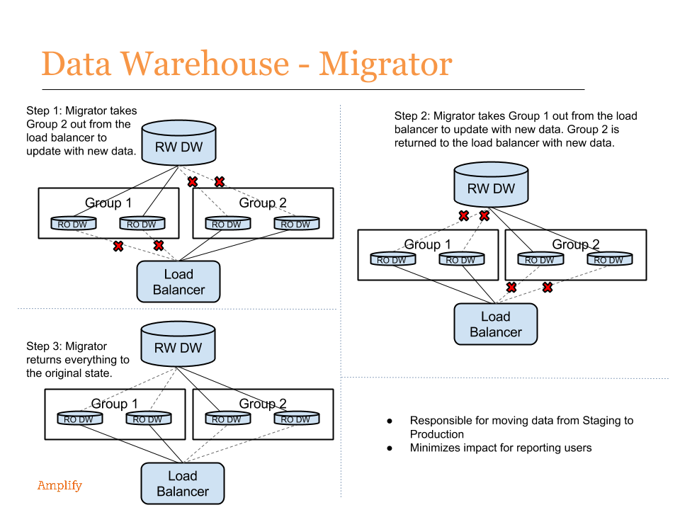

.. EdMigrate documentation master file, created by
   sphinx-quickstart on Mon Sep  8 11:54:50 2014.
   You can adapt this file completely to your liking, but it should at least
   contain the root `toctree` directive.

=====================================
EdMigrate Documentation
=====================================
Migrator is an application responsible for moving data from staging to production, while ensuring minimal impact for the reporting users. 
The migration process will orchestrate replication and load balancing of production database slaves so only half of them are down during 
the migration process and end-users will be able to continue accessing reports.

Contents:

.. toctree::
   :maxdepth: 2
   
   apidoc/edmigrate.rst

Indices and tables
==================

* :ref:`genindex`
* :ref:`modindex`
* :ref:`search`

